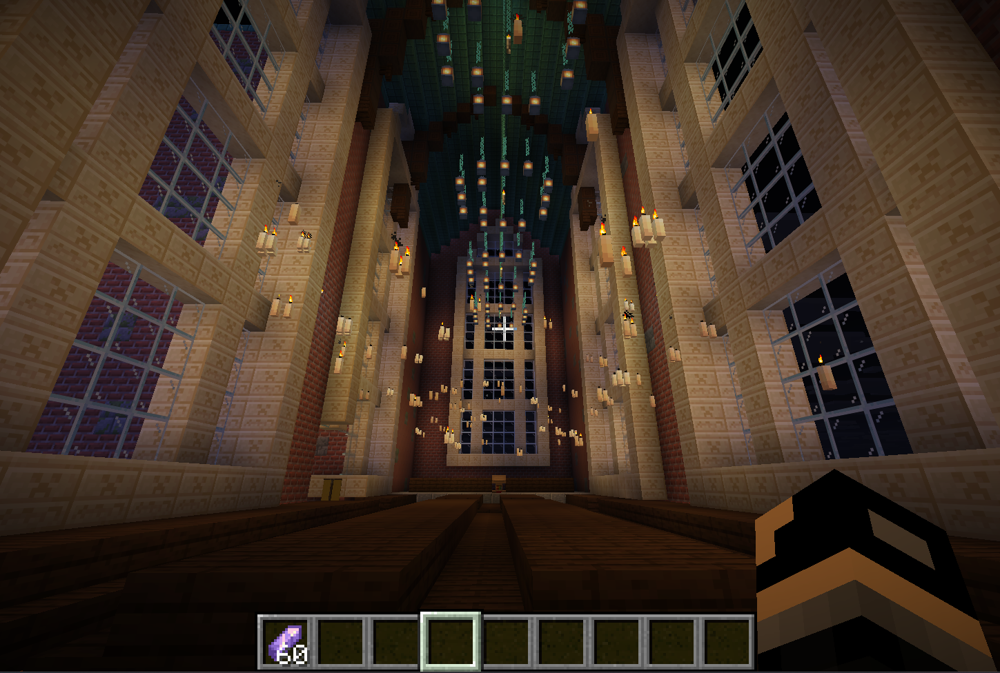
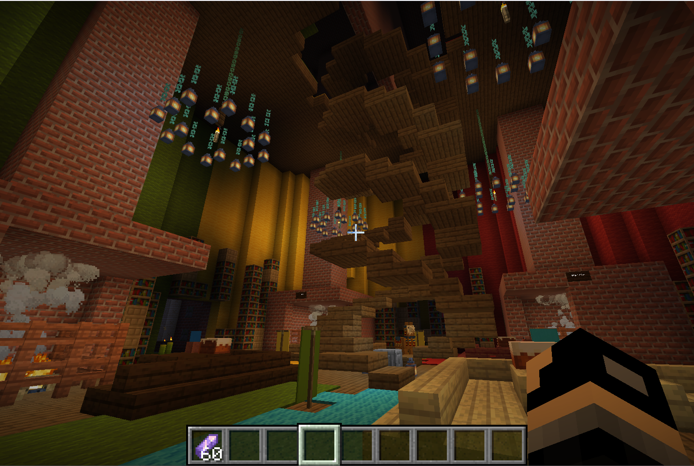
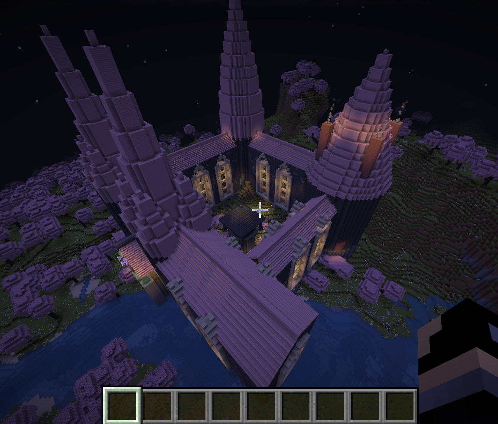
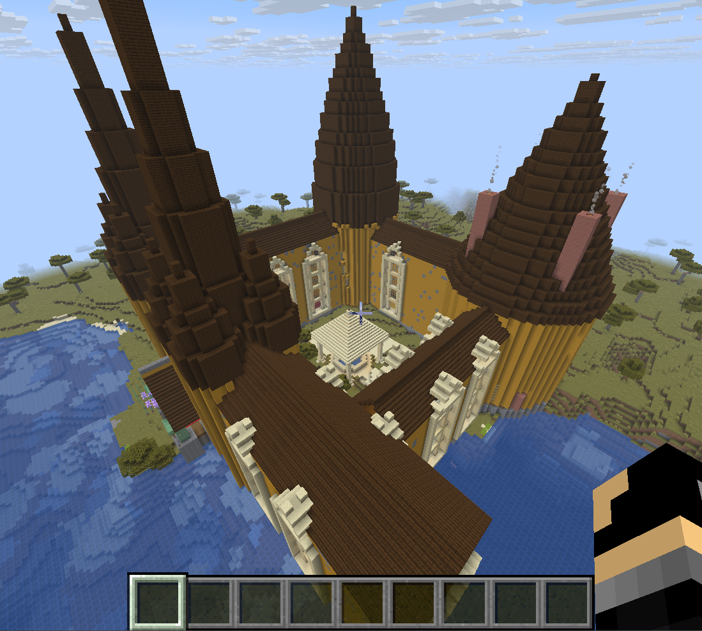

🏰 Hogwarts: Adaptive Procedural Generation in MinecraftA context-aware algorithmic pipeline designed to procedurally construct and seamlessly integrate a macro-structure—a Hogwarts-inspired castle—within a constrained $100 \times 100$ voxel build area.✨ The MagicTraditional generation often flattens the world. This pipeline actively engages with the environment:🗺️ Smart Site Selection: Captures the designated build area and evaluates the landscape to pinpoint the optimal construction plot.📐 Topographical Alignment: Uses gradient-based topographical alignment to naturally orient the structure.🌉 Adaptive Foundations: Employs adaptive foundation algorithms, utilizing voxel carving and the dynamic extrusion of multi-tiered viaducts to traverse varying elevations.❄️ Biome-Aware: Scans the environment to dynamically assign a high-contrast material palette for the walls and roofs.🎲 Infinite Variation: Each module in the structure is assembled using continuous mathematical functions with varying parameters, introducing procedural variations.🛠️ The PipelineScout: Evaluates candidate patches using a composite cost function balancing terrain variance, water, and vegetation.Orient: Calculates the terrain's natural gradient to identify the "downhill" vector, rotating the blueprint to face the valley.Adapt: Establishes a dynamic base height, carving into hillsides or extruding foundation columns and viaducts where necessary.Construct: Assembles the Great Hall, common room, library tower, and connecting corridors using parametric math.Inside the Castle

🌍 Dynamic BiomesThe algorithm dynamically swaps the material palettes based on the detected biome, shifting seamlessly from dark oak and spruce in snowy tundras to oxidized copper and sandstone in desert regions.

🚀 Quick StartRequirements: Python 3.9+, Minecraft Java Edition, and the GDMC HTTP interface.Bash# 1. Clone the repository
git clone https://github.com/rahulrao9/GDPC_Minecraft.git
cd GDPC_Minecraft

# 2. Install dependencies
pip install gdpc numpy scipy matplotlib

# 3. Generate the Castle! (Ensure Minecraft + GDMC HTTP mod is running)
python main.py
Note: The pipeline requires an average computational time of 414.43 seconds to fully scout, mathematically orient, and construct the furnished castle.